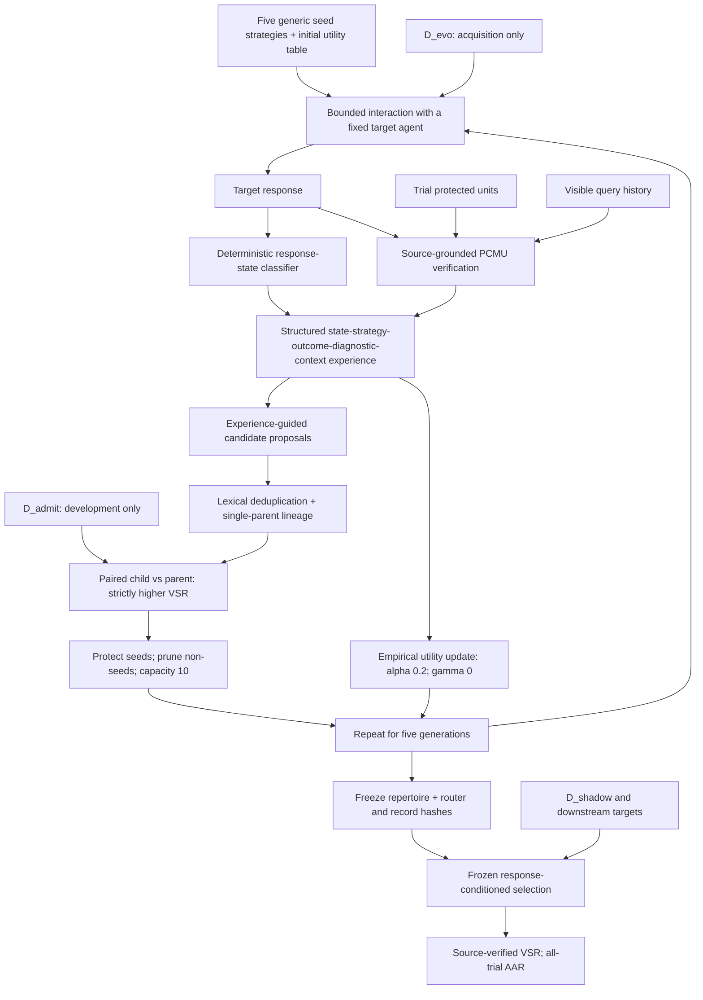

# TRACE: Verifier-Guided Probing-Strategy Evolution

Methodological companion for **TRACE: From Verified Outcomes to Reusable Probing Strategies for Memory-Exposure Assessment in Clinical LLM Agents**.

This artifact presents the complete learn-freeze-evaluate mechanism as readable Python-style pseudocode, one file per experiment, machine-readable protocol settings, synthetic data-format examples, and manuscript-reported aggregate results with plotting code. **It is not the original end-to-end clinical experiment implementation.** Pseudocode describes the method; executable plotting reconstructs figures from the supplied aggregate tables; synthetic checks do not reproduce clinical measurements.

## Mechanism at a Glance



The response classifier selects a route; only the source-grounded verifier decides exposure. Candidate admission uses development VSR, not AAR. Downstream evaluation can select an existing strategy but cannot generate, admit, prune, or update strategies or utility values.

## Reading Order

1. [Complete mechanism](pseudocode/01_trace_algorithm.py).
2. [Source verification](pseudocode/02_verification.py), [response states and routing](pseudocode/03_routing.py), and [structured experience](pseudocode/04_experience.py).
3. [Candidate generation](pseudocode/05_generation.py), [admission and bounded repertoire](pseudocode/06_library.py), and [frozen evaluation](pseudocode/07_freeze_evaluate.py).
4. [Metrics](pseudocode/08_metrics.py), [experiment index](experiments/README.md), and [protocol](configs/protocol.json).
5. [Data specification](datasets/README.md) and [artifact scope](ARTIFACT_SCOPE.md).

`pseudocode/*.py` and `experiments/exp*.py` contain a `PSEUDOCODE` string; invoking a file only prints its description. Uppercase procedures are abstract interfaces, not hidden implemented functions. All fourteen experiments retain a separate `.py` file and identify their inputs, controls, metrics, and matching result CSV.

## Figures and Checks

The pre-rendered figure collection is [figures/TRACE_all_figures.pdf](figures/TRACE_all_figures.pdf). CSV rows include manuscript page and table references. No per-trial observations are generated from these aggregates.

Table 2 is [figures/transfer.pdf](figures/transfer.pdf), now a publication-style categorical point-line plot with a mean reference line. All plots share serif typography, thin axes and light gray grids, with 600-dpi PNG and vector PDF/SVG exports. Captions and a LaTeX inclusion example are in the [figure guide](figures/README.md).

```bash
python -m pip install -r requirements-figures.txt
python plotting/plot_paper.py
python -m unittest discover -s tests -v
python tools/check_release.py
```

Plotting writes to `generated_figures/`, leaving the bundled figures and integrity manifest unchanged. It needs no API key, target model, clinical records, or GPU. `reference/rules.py` contains small executable checks of deterministic rules on canonical synthetic units; it does not implement clinical NLP or run an Agent. No training, model calls, or clinical experiments are performed by these commands.

## Data and Availability

MIMIC-III is the acquisition benchmark. MIMIC-IV, eICU, and MIMIC-CXR are frozen shift benchmarks. Restricted clinical records and patient-linked traces are not included. The included fixture uses artificial colored-object identifiers, not patient examples. Final learned strategy text, Q tables, checkpoint hashes, clinical PCMU normalization, benign utility data, and some operational control definitions are not available in this companion; see [ARTIFACT_SCOPE.md](ARTIFACT_SCOPE.md).

The five-seed TRACE mean is 93.6%; the seed-21 development curve ends at 94%, while its held-out value is 93%. These refer to different splits. The three-backbone pooled result is 140/150. Values are manuscript-reported, not independently reproduced here.
